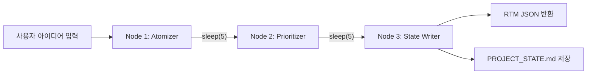

# 🛠️ PM Agent — 프로젝트 구축 완료 가이드

## 📂 프로젝트 구조

```
test_3/
├── backend/
│   ├── .env                    ← Google API 키 설정
│   ├── requirements.txt        ← Python 의존성
│   ├── main.py                 ← FastAPI 엔트리포인트
│   ├── agent/
│   │   ├── schemas.py          ← Pydantic 모델 (Requirement, RTM_Master)
│   │   ├── state.py            ← LangGraph State (TypedDict)
│   │   └── pm_graph.py         ← LangGraph 3-노드 파이프라인
│   └── utils/
│       └── file_io.py          ← PROJECT_STATE.md 저장 유틸리티
└── frontend/
    ├── index.html              ← SEO + Inter 폰트
    ├── vite.config.ts           ← Vite + React + Tailwind
    └── src/
        ├── main.tsx
        ├── index.css            ← Tailwind + 커스텀 디자인 시스템
        ├── api.ts               ← 백엔드 통신 모듈
        ├── App.tsx              ← 메인 대시보드 UI
        └── components/
            └── RtmTable.tsx     ← RTM 테이블 컴포넌트
```

## 🚀 실행 방법

### 1단계: 백엔드 설정

```bash
cd backend

# 가상환경 생성 (권장)
python -m venv venv
venv\Scripts\activate        # Windows

# 의존성 설치
pip install -r requirements.txt

# .env 파일에 API 키 입력
# GOOGLE_API_KEY=여기에_실제_키를_입력하세요
```

> [!IMPORTANT]
> `backend/.env` 파일의 `GOOGLE_API_KEY`에 Google Gemini API 키를 반드시 입력해야 합니다.
> [Google AI Studio](https://aistudio.google.com/apikey)에서 발급받을 수 있습니다.

### 2단계: 백엔드 실행

```bash
cd backend
uvicorn main:app --reload --port 8000
```

### 3단계: 프론트엔드 실행

```bash
cd frontend
npm run dev
```

브라우저에서 `http://localhost:5173` 접속

## 🏗️ 아키텍처 — LangGraph 파이프라인



| 노드 | 역할 | 출력 |
|------|------|------|
| **Atomizer** | 아이디어를 최소 단위 기능으로 분해 | `req_id`, `title`, `description` |
| **Prioritizer** | MoSCoW 우선순위 할당 | `priority` 필드 추가 |
| **State Writer** | Pydantic 검증 + MD 파일 저장 | `final_rtm` + `PROJECT_STATE.md` |

> [!NOTE]
> 무료 Gemini API의 Rate Limit(429 에러) 방지를 위해 각 노드 사이에 `time.sleep(5)`가 삽입되어 있습니다.
> 분석에는 약 15~30초가 소요됩니다.

## 🎨 프론트엔드 UI 미리보기


- **다크 그래디언트** 배경 (`#0f0c29` → `#302b63` → `#24243e`)
- **글래스모피즘** 카드 (반투명 + blur 효과)
- **MoSCoW 우선순위 배지**: 색상별 구분 (Must=빨강, Should=노랑, Could=초록, Won't=회색)
- **반응형 레이아웃**: 데스크톱 2-column, 모바일 스택

## 📡 API 명세

| 메서드 | 경로 | 설명 |
|--------|------|------|
| `POST` | `/api/analyze-idea` | 아이디어 텍스트를 받아 RTM을 반환 |
| `GET` | `/health` | 헬스체크 |

**Request Body:**
```json
{ "idea": "대학생을 위한 중고 교재 거래 플랫폼..." }
```

**Response:**
```json
{
  "requirements": [
    {
      "req_id": "REQ_001",
      "title": "사용자 회원가입/로그인",
      "description": "이메일 또는 학교 계정으로 가입...",
      "priority": "Must"
    }
  ]
}
```
